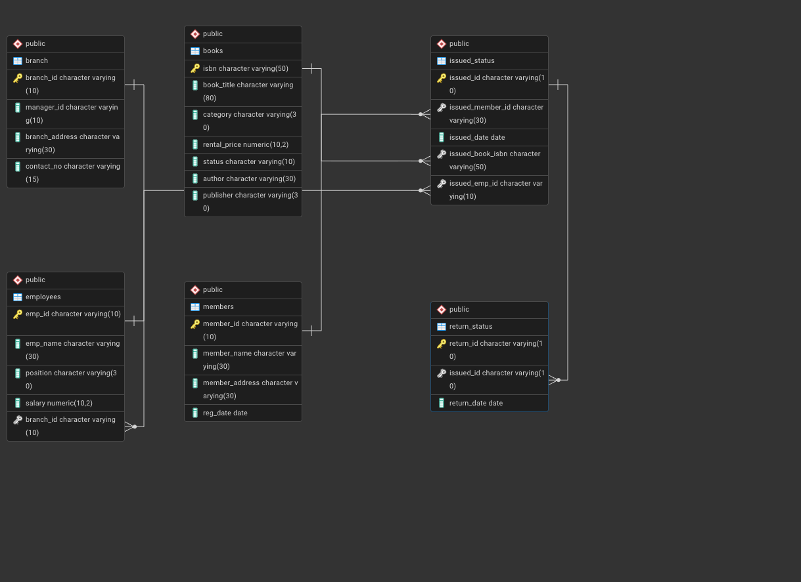

# Library Management System (SQL)

## Overview

This project demonstrates the implementation of a Library Management System using SQL. It includes creating and managing tables, performing CRUD operations, and executing advanced SQL queries.


## Objectives

1. **Set up the Library Management System Database**: Create and populate the database with tables for branches, employees, members, books, issued status, and return status.
2. **CRUD Operations**: Perform Create, Read, Update, and Delete operations on the data.
3. **CTAS (Create Table As Select)**: Utilize CTAS to create new tables based on query results.
4. **Advanced SQL Queries**: Develop complex queries to analyze and retrieve specific data.

## Tools Used
- PostgreSQL

### 1. Database Setup


- **Database Creation**: Created a database named `library_management_system`.
- **Table Creation**: Created tables for branches, employees, members, books, issued status, and return status. Each table includes relevant columns and relationships.

```sql
-- Branches
DROP TABLE IF EXISTS branch;
CREATE TABLE branch (
	branch_id VARCHAR(10) PRIMARY KEY,
    manager_id VARCHAR(10),
    branch_address VARCHAR(30),
    contact_no VARCHAR(15)
);

-- Employees
DROP TABLE IF EXISTS employees;
CREATE TABLE employees (
	emp_id VARCHAR(10) PRIMARY KEY,
    emp_name VARCHAR(30),
    position VARCHAR(30),
    salary DECIMAL(10,2),
    branch_id VARCHAR(10) REFERENCES branch(branch_id)
);

-- Books
DROP TABLE IF EXISTS books;
CREATE TABLE books (
	isbn VARCHAR(50) PRIMARY KEY,
    book_title VARCHAR(80),
    category VARCHAR(30),
    rental_price DECIMAL(10,2),
    status VARCHAR(10),
    author VARCHAR(30),
    publisher VARCHAR(30)
);

-- Members
DROP TABLE IF EXISTS members;
CREATE TABLE members (
	member_id VARCHAR(10) PRIMARY KEY,
    member_name VARCHAR(30),
    member_address VARCHAR(30),
    reg_date DATE
);

-- Issued Status
DROP TABLE IF EXISTS issued_status;
CREATE TABLE issued_status (
	issued_id VARCHAR(10) PRIMARY KEY,
    issued_member_id VARCHAR(30) REFERENCES members(member_id),
    issued_date DATE,
    issued_book_isbn VARCHAR(50) REFERENCES books(isbn),
    issued_emp_id VARCHAR(10) REFERENCES employees(emp_id)
);

-- Return Status
DROP TABLE IF EXISTS return_status;
CREATE TABLE return_status (
	return_id VARCHAR(10) PRIMARY KEY,
    issued_id VARCHAR(10) REFERENCES issued_status(issued_id),
    return_date DATE
);
```

### 2. CRUD Operations

**Task 1.** Create a New Book Record - "978-1-60129-456-2', 'To Kill a Mockingbird', 'Classic', 6.00, 'yes', 'Harper Lee', 'J.B. Lippincott & Co.'

```sql
INSERT INTO books
VALUES('978-1-60129-456-2','To Kill a Mockingbird', 'Classic', '6.00', 'yes', 'Harper Lee', 'J.B. Lippincott & Co.');
SELECT * FROM books;
```
**Task 2:** Update an Existing Member's Address

```sql
UPDATE members
SET member_address = '125 Oak St'
WHERE member_id = 'C103'
RETURNING *;
```

**Task 3:** Delete the record with issued_id = 'IS121' from the issued_status table.

```sql
DELETE FROM issued_status
WHERE issued_id = 'IS121'
RETURNING *;
```

**Task 4:** Retrieve All Books Issued by the employee with emp_id = 'E101'.

```sql
SELECT issued_emp_id, emp_name, isbn, book_title, issued_date, issued_member_id
FROM issued_status
INNER JOIN books
ON issued_status.issued_book_isbn = books.isbn
INNER JOIN employees
ON issued_status.issued_emp_id = employees.emp_id
WHERE issued_emp_id = 'E101';
```


**Task 5:** Find members who have issued more than one book.

```sql
SELECT issued_member_id, member_name, COUNT(issued_id) AS no_of_books_issued
FROM issued_status
INNER JOIN members
ON issued_status.issued_member_id = members.member_id
GROUP BY issued_member_id, member_name
HAVING COUNT(issued_id) > 1;
```

### 3. CTAS (Create Table As Select)

**Task 6:** Use CTAS to generate a new table for number of issues for each book

```sql
CREATE TABLE books_issued_count AS
SELECT isbn, book_title, COUNT(issued_id) AS number_of_issues
FROM issued_status
INNER JOIN books
ON issued_status.issued_book_isbn = books.isbn
GROUP BY isbn, book_title;
```

```sql
SELECT * FROM books_issued_count;
```


### 4. Data Analysis & Findings

**Task 7.** Retrieve All Books in a 'Classic' Category

```sql
SELECT * FROM books
WHERE category = 'Classic';
```

**Task 8:** Find Total Rental Income by Category

```sql
SELECT category, SUM(rental_price) AS total_rental_income
FROM books
INNER JOIN issued_status ON
issued_status.issued_book_isbn = books.isbn
GROUP BY category;
```

**Task 9:** List Members Who Registered in the Last 180 Days of available data
```sql
SELECT * FROM members
WHERE reg_date >= (
	SELECT MAX(reg_date)
	FROM members
) - INTERVAL '180 days';
```

**Task 10:** List Employees with Their Branch Manager's Name and their branch details

```sql
SELECT e1.emp_id, e1.emp_name,
e2.emp_id AS branch_manager_id, e2.emp_name AS branch_manager_name, 
b.branch_id, b.branch_address, b.contact_no
FROM branch AS b
INNER JOIN employees AS e1
ON b.branch_id = e1.branch_id
INNER JOIN employees AS e2
ON b.manager_id = e2.emp_id;
```

**Task 11:** Create a Table of Books with Rental Price Above 7.00
```sql
CREATE TABLE expensive_books AS
SELECT * FROM books
WHERE rental_price > 7.00;
```

```sql
SELECT * FROM expensive_books;
```

**Task 12:** Retrieve the List of Books Not Yet Returned

```sql
SELECT isbn, book_title FROM issued_status
LEFT OUTER JOIN return_status
ON issued_status.issued_id = return_status.issued_id
INNER JOIN books
ON issued_status.issued_book_isbn = books.isbn
WHERE return_status.return_id IS NULL;
```

**Task 13:** Identify members whose books were not returned within 30 days of the issue date

```sql
SELECT member_id, member_name, book_title, issued_date,
(return_date - issued_date) - 30 AS days_overdue
FROM issued_status
INNER JOIN return_status
ON issued_status.issued_id = return_status.issued_id
INNER JOIN books
ON issued_status.issued_book_isbn = books.isbn
INNER JOIN members
ON issued_status.issued_member_id = members.member_id
WHERE (return_date - issued_date) > 30;
```

**Task 14:** Update the status of books in the books table to "Yes" when they are returned  
Write a query to update the status of books in the books table to "Yes" when they are returned (based on entries in the return_status table).

```sql
UPDATE books
SET status = 'yes'
FROM issued_status
INNER JOIN return_status
ON issued_status.issued_id = return_status.issued_id
WHERE books.isbn = issued_status.issued_book_isbn;
```

**Task 15:** Generate a performance report for each branch, showing the number of books issued, the number of books returned, and the total revenue generated from book rentals.

```sql
CREATE TABLE branch_performance_report AS
SELECT b.branch_id,
COUNT(i.issued_id) AS no_of_books_issued, 
COUNT(r.return_id) AS no_of_books_returned,
SUM(rental_price) AS total_revenue_generated
FROM branch AS b
INNER JOIN employees AS e
ON b.branch_id = e.branch_id
INNER JOIN issued_status AS i
ON e.emp_id = i.issued_emp_id
LEFT OUTER JOIN return_status AS r
ON i.issued_id = r.issued_id
INNER JOIN books b1
ON b1.isbn = i.issued_book_isbn
GROUP BY b.branch_id
ORDER BY b.branch_id;
```

```sql
SELECT * FROM branch_performance_report;
```

## Conclusion

The Library Management System project demonstrates the practical implementation of relational database design using PostgreSQL. It covers database creation, CRUD operations, advanced joins, CTAS, and analytical queries to track book circulation, overdue returns, rental revenue, and branch performance.

## How to Clone this Project

1. **Clone the Repository:** Run the following code in your computer's command line interface.
   ```sh
   git clone https://github.com/aayushmanmukherjee/Library_Management_SQL.git
   ```

2. **Set Up the Database and Tables:** Execute the SQL script file named `schemas.sql`
3. **Inserting Values in the Tables:** Use the given datasets (csv) files to populate the tables with values. 
4. **Run the Queries:** Execute the SQL script file named `library_management_queries.sql` one query at a time to see the desired results.

- [schemas.sql file link](https://github.com/aayushmanmukherjee/Library_Management_SQL/blob/main/schemas.sql)
- [library_management_queries.sql file link](https://github.com/aayushmanmukherjee/Library_Management_SQL/blob/main/library_management_queries.sql)
